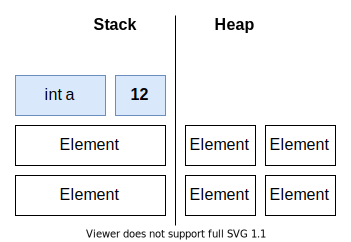

**Studentnaam:** Yorrick Bakker

**Studentnummer:** 623528

# Algemene beschrijving applicatie

# Generics

## Beschrijving van concept in eigen woorden

Generics maken het mogelijk om variabele typen in een klasse te gebruiken. Deze
language feature werd in
[C# 2.0](https://docs.microsoft.com/en-us/dotnet/csharp/whats-new/csharp-version-history#c-version-20)
geïntroduceerd. Het gebruik van generics brengt een aantal voordelen met zich
mee.

### Reusability

Generics kunnen de (her)bruikbaarheid van code drastisch verbeteren. Een goed
voorbeeld is de `List<T>` klasse. Zonder generics zou er voor elk datatype waar
men een lijst van zou willen maken een nieuwe implementatie gemaakt moeten
worden.

### Type safety

Een ander voordeel van generics is dat het een _type-safe_ oplossing is. Het is
namelijk ook mogelijk om een klasse op een andere manier meerdere types te laten
ondersteunen, bijvoorbeeld door een parameter te typeren met een superklasse van
alle ondersteunde types. Het gebruik van `object` is hier een voorbeeld van:

```cs
class List {
  object[] values;

  public void Add(object value) {
    // etc
  }
}
```

Hiermee is de klasse eigenlijk net zo herbruikbaar als een generieke klasse,
maar het grote nadeel is dat het op geen enkel moment duidelijk is welk type de
waarden in de lijst hebben. Het is dus bijvoorbeeld ook mogelijk om integers toe
te voegen aan een lijst die als string-lijst bedoeld was, tenzij je zelf een
complex type-checking systeem in je klasse implementeert. Maar dat is natuurlijk
verre van wenselijk.

### Performance

Het gebruik van generics kan zorgen voor een betere performance t.o.v. het voorbeeld uit de vorige paragraaf. Dit heeft te maken met het _boxen_ en _unboxen_ van variabelen. Dit valt goed te demonstreren met het voorbeeld uit de vorige paragraaf. De details van boxing en unboxing worden besproken in [Boxing & Unboxing](#boxing--unboxing). Het belangrijkste is dat het ervoor zorgt dat het ([ongeveer 20x trager wordt, volgens Microsoft](https://docs.microsoft.com/en-us/dotnet/framework/performance/performance-tips#boxing-and-unboxing)).

### Type constraints

Het is mogelijk om de typen die een generieke klasse mag hebben te beperken. Hier wordt het `where` keyword voor gebruikt.

```cs
class Compare<T> where T : IComparable<T> {
}
```

Dit voorbeeld geeft aan dat het type van `T` alleen een type mag zijn wat ook de `IComparable<T>` interface implementeert. Ook kan er in de type constraints aangegeven worden dat het type een (publieke) constructor zonder parameters moet hebben:

```cs
class Compare<T> where T : IComparable<T>, new() {
}
```

Op die manier kan er verzekerd worden dat de klasse altijd geïnstantieerd kan worden, en kan er in de klasse bijvoorbeeld een nieuwe instantie van `T` (`new T()`) worden aangemaakt.

## Code voorbeeld van je eigen code
Ik heb generics toegepast bij een validatieklasse (`Validatable<T>`). Deze klasse kan variabelen valideren aan de hand van een opgegeven `delegate`. Deze `delegate` (`Predicate<T>`) krijgt één parameter mee van het type `T`. Vervolgens kan de originele waarde van de variabele ook opgehaald worden, en deze heeft ook het type `T`. Daardoor gaat de type-safety niet verloren.

```cs
public class Validatable<T>
{
    public T Value { get; set; }
    public Predicate<T> Validator { get; set; }

    public Validatable(T value, Predicate<T> validator)
    {
        Value = value;
        Validator = validator;
    }

    public bool Valid()
    {
        return Validator(Value);
    } 
}
```

Deze klasse wordt als volgt gebruikt (verkleind voor leesbaarheid):

```cs
public class ConnectionSettings
{
    private Validatable<string> NameValidatable { get; }
    private Validatable<string> IpAddressValidatable { get; }

    private readonly Predicate<string> _nameValidator = (name) => !string.IsNullOrEmpty(name) && name.Length > 1 && name.Length < 20;

    private readonly Predicate<string> _ipValidator = (ip) => IPAddress.TryParse(ip, out _);
    
    public string Name => NameValidatable.Value;
    public IPAddress IpAddress => IpAddressValidatable.Valid() ? IPAddress.Parse(IpAddressValidatable.Value) : null;

    public bool Valid => NameValidatable.Valid() && IpAddressValidatable.Valid() && PortValidatable.Valid() && BufferSizeValidatable.Valid();
}
```
## Alternatieven & adviezen
Zoals eerder gezegd is een alternatief voor het gebruik van generics het `object`-type. In mijn ogen is dit echter geen bruikbaar alternatief omdat het t.o.v. generics alleen maar nadelen heeft. Mijn advies is daarom om gewoon gebruik te maken van generics, het zit niet voor niets al sinds C# 2.0 in de language specification!

Dat gezegd hebbende is het natuurlijk ook niet wenselijk om generics te pas en te onpas toe te passen. Er zijn scenario's denkbaar waar generics onnodig zijn en alleen complexiteit toevoegen. Denk dus goed na of generics eigenlijk wel nodig zijn.
## Authentieke en gezaghebbende bronnen

- [Microsoft: Generics (C# Programming Guide)](https://docs.microsoft.com/en-us/dotnet/csharp/programming-guide/generics/)
- [Microsoft: where (generic type constraint) (C# Reference)](https://docs.microsoft.com/en-us/dotnet/csharp/language-reference/keywords/where-generic-type-constraint)

# Boxing & Unboxing

## Beschrijving van concept in eigen woorden

Om dit concept uit te leggen is het voor de context belangrijk om eerst het verschil tussen een `ValueType` en een `ReferenceType` uit te leggen. Een `ValueType` bevat direct de waarde van de variabele op de stack. Een voorbeeld is `int`, bij het declareren van een `int` bevat die variabele dus gelijk de waarde:

```cs
int a = 12;
```

Het geheugenmodel ziet er dan ongeveer zo uit:



Bij een `ReferenceType` wordt de variabele ook op de stack aangemaakt, maar de waarde komt in de heap te staan. De variabele in de stack krijgt dan de referentie naar de heap als waarde. Een voorbeeld is `string`:

```cs
string text = "asdf";
```

Het geheugenmodel ziet er dan ongeveer zo uit:


Boxen is eigenlijk de conversie van een `ValueType` naar een `ReferenceType`. Omdat alle `ValueType`s afstammen van `System.Object` gaat het eigenlijk altijd om de conversie van bijvoorbeeld `int` naar `object`. Deze conversie kan C# moeiteloos uitvoeren, zelfs dit vindt de compiler prima:

```cs
object x = 123;
```

Hier wordt al een `int` geboxt in een `object`. Een duidelijker voorbeeld:

```cs
List<object> cijfers = new List<object>();
int value = 12; // -> Hier is value nog een ValueType
cijfers.Add(value); // -> Hier wordt de waarde geboxt in een object
```

Unboxing is logischerwijs het omgekeerde van boxing:

```cs
object v = cijfers[0]; // -> object met waarde 12 op de heap
int value = (int) v; // -> ValueType int met waarde 12 op de stack
```

De C#-runtime kan dit soort conversies dus "on the fly" uitvoeren. Het nadeel is, zoals eerder gezegd, dat dit een flinke performance penalty met zich meebrengt.
## Code voorbeeld van je eigen code

Ik maak geen gebruik van boxing en unboxing in mijn code. In de vorige paragraaf heb ik al een aantal codevoorbeelden gebruikt.
## Alternatieven & adviezen

Mijn advies is om boxing en unboxing zoveel mogelijk te vermijden. In de huidige versie van C# kan ik hier geen toepassing voor bedenken die niet door iets anders opgelost kan worden. Een voorbeeld van een toepassing in een vroege versie van C# is de `ArrayList`-klasse. Deze maakt gebruik van `object` om meerdere datatypes te ondersteunen. Inmiddels is er echter een `List<T>`-klasse die dit oplost m.b.v. generics. Microsoft zelf raad dan ook af om nog langer `ArrayList` toe te passen.
## Authentieke en gezaghebbende bronnen
- [Microsoft: Boxing and Unboxing (C# Programming Guide)](https://docs.microsoft.com/en-us/dotnet/csharp/programming-guide/types/boxing-and-unboxing)
- [Microsoft: ValueType Class](https://docs.microsoft.com/en-us/dotnet/api/system.valuetype?view=net-5.0)
- [Microsoft: ArrayList Class #Remarks](https://docs.microsoft.com/en-us/dotnet/api/system.collections.arraylist?view=net-5.0#remarks)
# Delegates & Invoke

## Beschrijving van concept in eigen woorden
Een delegate is, als het ware, een "blueprint" voor een functie. Het maakt het mogelijk om functies als variabele de declareren, waardoor deze o.a. als parameter aan andere functie meegegeven kan worden. Een delegate wordt als volgt gedefinieerd:

```cs
delegate void Handler(string message);
```

Na deze regel code bestaat het type `Handler`. Dit type kan bijvoorbeeld gebruikt worden als parameter:

```cs
void ButtonClicked(Handler handle) {
  handle("Button was clicked");
  // of handle.Invoke("Button was clicked");
}
```

Een delegate kan aangeroepen worden alsof het een "gewone" functie is, dus met `()`. Op de achtergrond wordt echter `.Invoke(...)` aangeroepen, het is ook mogelijk om dat handmatig te doen. Er is geen functioneel verschil tussen deze mogelijkheden.

### Named vs anonymous

Een delegate-type kan als normaal type gebruikt worden. Er kunnen dus ook gewoon variabelen gemaakt worden die aan een functie refereren:

```cs
Handler handle = HandleButtonClick;

void HandleButtonClick(string message) {
  Console.WriteLine(message);
}
```

Vanaf dat moment bevat de variabele `handle` een referentie naar `HandleButtonClick`. In dit geval is er sprake van een "Named delegate". Het is echter ook mogelijk om een anonymous delegate te maken, dat maakt de syntax iets compacter:

```cs
Handler handle = delegate(string message) {
  Console.WriteLine(message);
}
```

Functioneel doet dit hetzelfde als het vorige voorbeeld.

### Lambda expressions

Het is sinds C# 3.0 ook mogelijk om lambda expressions te gebruiken bij het definiëren van anonymous delegates. Lambda expressions zijn iets flexibeler:

```cs
Handler handle = message => {
  Console.WriteLine(message);
}
```

Lambda expressions maken _type inference_ mogelijk bij delegate-instanties. De compiler kan er aan de hand van de signature van het delegate-type (`Handler(string message)`) vanuit gaan dat de eerste parameter van het type `string` is. Daarom is het bij lambda's mogelijk om de typering weg te laten. Expliciete typeringen zijn nog steeds toegestaan.

Bij lambda expressions bestaat ook nog een onderscheid tussen _expression lambda's_ en _statement lambda's_. Een statement lambda heeft _curly brackets_ (`{}`) en kan uit meerdere regels bestaan. Een expression lambda heeft geen curly brackets, bestaat uit één regel en returnt het stuk code na de `=>` operator:

```cs
delegate int Calcfn(int a, int b);

Calcfn sum = (a,b) => a + b;
Calcfn product = (a,b) => a * b;
```

Dit maakt de code wederom compacter en mogelijk makkelijker leesbaar.

### Multicasting

Delegate _multicasting_ maakt het mogelijk om meerdere instanties van een delegate tegelijkertijd aan te roepen. Een multicast delegate heeft hetzelfde type als al zijn "children". Delegates van hetzelfde type kunnen aan een delegate toegevoegd worden met de `+` operator. M.b.v. de `-` operator kunnen ze vervolgens ook weer verwijderd worden. Dit ziet er ongeveer zo uit:

```cs
delegate void Protocol(string user);

Protocol Hi = user => Console.WriteLine($"Hello {user}!");
Protocol Time = user => Console.WriteLine($"{user}, it's currently {time}.");
Protocol Bye = user => Console.WriteLine($"Goodbye {user}.");

Protocol sequence = Hi;
sequence += Time;
sequence += Bye;

sequence("admin");
/* > Hello admin!
 * > admin, it's currently 2:30.
 * > Goodbye admin.
 */

sequence -= Time;

sequence("admin");
/* > Hello admin!
 * > Goodbye admin.
 */
```

NB: Technisch gezien is de volgorde van uitvoering van multicast delegates niet gedefinieerd ("undefined" volgens Microsoft). Het is "toevallig" zo dat delegates nu in dezelfde volgorde als dat ze worden toegevoegd worden uitgevoerd, maar het is best mogelijk dat dit in de toekomst verandert. Het is daarom geen goed idee om hier vanuit te gaan ([meer informatie](https://stackoverflow.com/a/24484801/3235858)).
## Code voorbeeld van je eigen code

Ik gebruik geen custom delegates. Wel maak ik gebruik van de ingebouwde `Predicate<T>` delegate (zie `MultiChat.Common/ConnectionSettings.cs`):

```cs
private readonly Predicate<string> _nameValidator = (name) => !string.IsNullOrEmpty(name) && name.Length > 1 && name.Length < 20;
```
## Alternatieven & adviezen

Delegates zijn heel nuttig, met name bij het gebruik van callbacks in events. In modern C# is het echter de vraag of het zelf definiëren van delegates nog wel nodig is. Er zitten namelijk al generic delegate types ingebouwd, waaronder `Action<T>`, `Func<T,TResult>` en `Predicate<T>`. `Action` is voor `void`-achtigen, `Func` is voor methodes die iets returnen en `Predicate` is voor methodes die één parameter hebben een een boolean returnen. `Action` en `Func` hebben implementaties met ondersteuning voor 0-16 parameters ([`Func` met 16 parameters](https://docs.microsoft.com/en-us/dotnet/api/system.func-17?view=net-5.0)) en zullen dus voor de bijna alle gevallen voldoende mogelijkheden bieden. 

Het is dus belangrijk om goed na te denken voor je een custom delegate maakt, en of het niet gewoon opgelost kan worden met een ingebouwde delegate. Een extra overweging is dat bijvoorbeeld alle `Action` implementaties gemulticast kunnen worden, eigen implementaties met verschillende typen kunnen dat niet. 
## Authentieke en gezaghebbende bronnen
- [Delegates (C# Programming Guide)](https://docs.microsoft.com/en-us/dotnet/csharp/programming-guide/delegates/)
- [Delegates with Named vs. Anonymous Methods (C# Programming Guide)](https://docs.microsoft.com/en-us/dotnet/csharp/programming-guide/delegates/delegates-with-named-vs-anonymous-methods)
- [Lambda expressions (C# reference)](https://docs.microsoft.com/en-us/dotnet/csharp/language-reference/operators/lambda-expressions)
- [How to combine delegates (Multicast Delegates) (C# Programming Guide)](https://docs.microsoft.com/en-us/dotnet/csharp/programming-guide/delegates/how-to-combine-delegates-multicast-delegates)

# Threading & Async

## Beschrijving van concept in eigen woorden
Dit concept heeft te maken met het gelijktijdig (asynchroon) uitvoeren van code. In C# berust parralellisatie grotendeels op het concept _thread pool_.


Kort gezegd alloceert de C#-runtime een aantal software threads. Deze threads vormen vervolgens samen de thread pool, waar vervolgens stukken code op uitgevoerd kunnen worden. Een thread in C# heeft dus niks te maken met een hardware-thread in een CPU. Het operating system bepaalt uiteindelijk welke processen op welk deel van de hardware en wanneer worden uitgevoerd.

C# heeft een abstractielaag die onder water gebruik maakt van een thread pool. Deze abstractielaag heet Task Parallel Library, oftewel TPL. In TPL wordt het concept `Task` geïntroduceerd. Dit representeert een stuk werk, of taak, die het programma uit moet voeren. Conceptueel gezien is een `Task` vergelijkbaar met een `Promise` in JavaScript.

De TPL maakt asynchroon programmeren een stuk minder complex en beter toegankelijk. Door een functie een `Task` te laten returnen en het `async` keyword in de signature te gebruiken kan de code asynchroon uitgevoerd worden.


```cs
async Task DoWork() {
  await ComplexOperation();
}
```

Het `await` keyword wacht tot een `Task` is afgerond. Als er meerdere `Task`s gelijktijdig uitgevoerd worden kan deze aan een variabele toegewezen worden:

```cs
async Task DoWork() {
  var op1 = ComplexOperation() // returns Task<string>;
  var op2 = SomeOtherOperation() // returns Task;

  string result = await op1();
  DoStuff(result);

  await op2();
}
```

Of een lijst met taken:

```cs
async Task DoWork() {
  var numbers = new List<int> {1,2,3,4,5};
  var tasks = new List<Task>();
  foreach (var number in numbers) {
    tasks.Add(ComplexOperation(number)); // returns Task
  }

  await Task.WhenAll(tasks);
}
```

Op die manier wachten asynchroon uitvoerbare taken niet onnodig op elkaar.

## Code voorbeeld van je eigen code
Ik maak op heel veel plekken gebruik van async/await en de TPL. Een onconventioneel voorbeeld is misschien dit:
```cs
private async void ReadAsync(Client client, CancellationToken token)
{
    while (!token.IsCancellationRequested)
    {
        try
        {
            var stream = client.TcpClient.GetStream();
            var message = new Message();
            do
            {
                var buffer = new byte[Settings.BufferSize];
                int bytesRead = await stream.ReadAsync(buffer, 0, Settings.BufferSize, token);
                if (bytesRead > 0)
                {
                    message.Append(buffer);
                }
            } while (!message.Terminated && stream.DataAvailable);

            if (message.Empty) continue;
            if (message.Special)
            {
                HandleSpecialMessage(client, message);
            }
            else
            {
                var decoded = message.Decode();
                AppendMessage(decoded);
                await BroadcastMessage(decoded, client);
            }
        }
        catch (Exception ex) when (ex is InvalidOperationException || ex is ObjectDisposedException ||
                                    ex is IOException)
        {
            // The client is no longer connected properly
            DisconnectClient(client);
            return;
        }
    }
}
```

Ik maak hier gebruik van `async void` in plaats van `async Task`. Over het algemeen kan `async void` beter vermeden worden. Het beschrijft namelijk een operatie die op de achtergrond plaatsvindt en returnt geen task. Daarnaast kunnen exceptions niet met een eenvoudige `try {} catch {}` afgehandeld worden. `async void` wordt vooral gebruikt bij event handlers, dus stukken code die constant op de achtergrond kijken of er bijvoorbeeld een knop is ingedrukt.

Ik heb in dit geval expliciet voor deze oplossing gekozen, omdat ik denk dat het de meest duidelijke is. De _caller_ kan gewoon `ReadAsync()` aanroepen, dus zonder await. Als ik gebruik had willen maken van `Task` had ik dit ook kunnen doen, maar dan is de compiler het er niet mee eens en moet je de methode aan een "discard" binden:

```cs
_ = ReadAsync()
```

Dit heeft in principe hetzelfde resultaat, maar vind ik eerder een lelijke workaround. Het gebruik van `async void` brengt in mijn applicatie geen nadelen met zich mee, omdat ik exceptions in de methode zelf afhandel. Omdat het lezen van een `NetworkStream` in mijn ogen alles weg heeft van een event vind ik het in dit geval een passende oplossing.
## Alternatieven & adviezen

Een alternatief voor het gebruik van de TPL is het handmatig aanmaken van threads. Deze operatie bevindt zich dichter bij de hardware maar wordt over het algemeen afgeraden. De TPL-laag heeft een stuk meer mogelijkheden zoals cancellation, exception handling en progress reports. Het versimpelt het asynchroon uitvoeren van code enorm, op technisch en conceptueel gebied.

Mijn advies is om code zoveel mogelijk asynchroon uit te voeren. De C#-runtime weet hoe hij om moet gaan met grote hoeveelheden tasks, en het resultaat is een meetbaar snellere applicatie. Asynchroon programmeren is echter geen vervanging voor algoritmeoptimalisaties, en het is zeker van belang om kritisch te blijven kijken naar de functionaliteit en complexiteit van de code.
## Authentieke en gezaghebbende bronnen
- [Wikipedia: Thread pool](https://en.wikipedia.org/wiki/Thread_pool)
- [Task-based asynchronous programming](https://docs.microsoft.com/en-us/dotnet/standard/parallel-programming/task-based-asynchronous-programming)