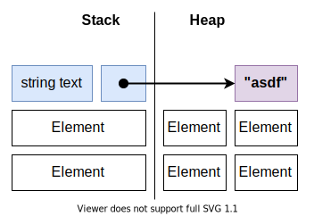

**Studentnaam:** Yorrick Bakker

**Studentnummer:** 623528

# Algemene beschrijving applicatie

# Generics

## Beschrijving van concept in eigen woorden

Generics maken het mogelijk om variabele typen in een klasse te gebruiken. Deze
language feature werd in
[C# 2.0](https://docs.microsoft.com/en-us/dotnet/csharp/whats-new/csharp-version-history#c-version-20)
geïntroduceerd. Het gebruik van generics brengt een aantal voordelen met zich
mee.

### Reusability

Generics kunnen de (her)bruikbaarheid van code drastisch verbeteren. Een goed
voorbeeld is de `List<T>` klasse. Zonder generics zou er voor elk datatype waar
men een lijst van zou willen maken een nieuwe implementatie gemaakt moeten
worden.

### Type safety

Een ander voordeel van generics is dat het een _type-safe_ oplossing is. Het is
namelijk ook mogelijk om een klasse op een andere manier meerdere types te laten
ondersteunen, bijvoorbeeld door een parameter te typeren met een superklasse van
alle ondersteunde types. Het gebruik van `object` is hier een voorbeeld van:

```cs
class List {
  object[] values;

  public void Add(object value) {
    // etc
  }
}
```

Hiermee is de klasse eigenlijk net zo herbruikbaar als een generieke klasse,
maar het grote nadeel is dat het op geen enkel moment duidelijk is welk type de
waarden in de lijst hebben. Het is dus bijvoorbeeld ook mogelijk om integers toe
te voegen aan een lijst die als string-lijst bedoeld was, tenzij je zelf een
complex type-checking systeem in je klasse implementeert. Maar dat is natuurlijk
verre van wenselijk.

### Performance

Het gebruik van generics kan zorgen voor een betere performance t.o.v. het voorbeeld uit de vorige paragraaf. Dit heeft te maken met het _boxen_ en _unboxen_ van variabelen. Dit valt goed te demonstreren met het voorbeeld uit de vorige paragraaf. De details van boxing en unboxing worden besproken in [Boxing & Unboxing](#boxing--unboxing). Het belangrijkste is dat het ervoor zorgt dat het ([ongeveer 20x trager wordt, volgens Microsoft](https://docs.microsoft.com/en-us/dotnet/framework/performance/performance-tips#boxing-and-unboxing)).

### Type constraints

Het is mogelijk om de typen die een generieke klasse mag hebben te beperken. Hier wordt het `where` keyword voor gebruikt.

```cs
class Compare<T> where T : IComparable<T> {
}
```

Dit voorbeeld geeft aan dat het type van `T` alleen een type mag zijn wat ook de `IComparable<T>` interface implementeert. Ook kan er in de type constraints aangegeven worden dat het type een (publieke) constructor zonder parameters moet hebben:

```cs
class Compare<T> where T : IComparable<T>, new() {
}
```

Op die manier kan er verzekerd worden dat de klasse altijd geïnstantieerd kan worden, en kan er in de klasse bijvoorbeeld een nieuwe instantie van `T` (`new T()`) worden aangemaakt.

## Code voorbeeld van je eigen code
Ik heb generics toegepast bij een validatieklasse (`Validatable<T>`). Deze klasse kan variabelen valideren aan de hand van een opgegeven `delegate`. Deze `delegate` (`Predicate<T>`) krijgt één parameter mee van het type `T`. Vervolgens kan de originele waarde van de variabele ook opgehaald worden, en deze heeft ook het type `T`. Daardoor gaat de type-safety niet verloren.

```cs
public class Validatable<T>
{
    public T Value { get; set; }
    public Predicate<T> Validator { get; set; }

    public Validatable(T value, Predicate<T> validator)
    {
        Value = value;
        Validator = validator;
    }

    public bool Valid()
    {
        return Validator(Value);
    } 
}
```

Deze klasse wordt als volgt gebruikt (verkleind voor leesbaarheid):

```cs
public class ConnectionSettings
{
    private Validatable<string> NameValidatable { get; }
    private Validatable<string> IpAddressValidatable { get; }

    private readonly Predicate<string> _nameValidator = (name) => !string.IsNullOrEmpty(name) && name.Length > 1 && name.Length < 20;

    private readonly Predicate<string> _ipValidator = (ip) => IPAddress.TryParse(ip, out _);
    
    public string Name => NameValidatable.Value;
    public IPAddress IpAddress => IpAddressValidatable.Valid() ? IPAddress.Parse(IpAddressValidatable.Value) : null;

    public bool Valid => NameValidatable.Valid() && IpAddressValidatable.Valid() && PortValidatable.Valid() && BufferSizeValidatable.Valid();
}
```
## Alternatieven & adviezen
Zoals eerder gezegd is een alternatief voor het gebruik van generics het `object`-type. In mijn ogen is dit echter geen bruikbaar alternatief omdat het t.o.v. generics alleen maar nadelen heeft. Mijn advies is daarom om gewoon gebruik te maken van generics, het zit niet voor niets al sinds C# 2.0 in de language specification!

Dat gezegd hebbende is het natuurlijk ook niet wenselijk om generics te pas en te onpas toe te passen. Er zijn scenario's denkbaar waar generics onnodig zijn en alleen complexiteit toevoegen. Denk dus goed na of generics eigenlijk wel nodig zijn.
## Authentieke en gezaghebbende bronnen

- [Microsoft: Generics (C# Programming Guide)](https://docs.microsoft.com/en-us/dotnet/csharp/programming-guide/generics/)
- [Microsoft: where (generic type constraint) (C# Reference)](https://docs.microsoft.com/en-us/dotnet/csharp/language-reference/keywords/where-generic-type-constraint)

# Boxing & Unboxing

## Beschrijving van concept in eigen woorden

Om dit concept uit te leggen is het voor de context belangrijk om eerst het verschil tussen een `ValueType` en een `ReferenceType` uit te leggen. Een `ValueType` bevat direct de waarde van de variabele op de stack. Een voorbeeld is `int`, bij het declareren van een `int` bevat die variabele dus gelijk de waarde:

```cs
int a = 12;
```

Het geheugenmodel ziet er dan ongeveer zo uit:


Bij een `ReferenceType` wordt de variabele ook op de stack aangemaakt, maar de waarde komt in de heap te staan. De variabele in de stack krijgt dan de referentie naar de heap als waarde. Een voorbeeld is `string`:

```cs
string text = "asdf";
```

Het geheugenmodel ziet er dan ongeveer zo uit:



Boxen is eigenlijk de conversie van een `ValueType` naar een `ReferenceType`. Omdat alle `ValueType`s afstammen van `System.Object` gaat het eigenlijk altijd om de conversie van bijvoorbeeld `int` naar `object`. Deze conversie kan C# moeiteloos uitvoeren, zelfs dit vindt de compiler prima:

```cs
object x = 123;
```

Hier wordt al een `int` geboxt in een `object`. Een duidelijker voorbeeld:

```cs
List<object> cijfers = new List<object>();
int value = 12; // -> Hier is value nog een ValueType
cijfers.Add(value); // -> Hier wordt de waarde geboxt in een object
```

Unboxing is logischerwijs het omgekeerde van boxing:

```cs
object v = cijfers[0]; // -> object met waarde 12 op de heap
int value = (int) v; // -> ValueType int met waarde 12 op de stack
```

De C#-runtime kan dit soort conversies dus "on the fly" uitvoeren. Het nadeel is, zoals eerder gezegd, dat dit een flinke performance penalty met zich meebrengt.
## Code voorbeeld van je eigen code

Ik maak geen gebruik van boxing en unboxing in mijn code. In de vorige paragraaf heb ik al een aantal codevoorbeelden gebruikt.
## Alternatieven & adviezen

Mijn advies is om boxing en unboxing zoveel mogelijk te vermijden. In de huidige versie van C# kan ik hier geen toepassing voor bedenken die niet door iets anders opgelost kan worden. Een voorbeeld van een toepassing in een vroege versie van C# is de `ArrayList`-klasse. Deze maakt gebruik van `object` om meerdere datatypes te ondersteunen. Inmiddels is er echter een `List<T>`-klasse die dit oplost m.b.v. generics. Microsoft zelf raad dan ook af om nog langer `ArrayList` toe te passen.
## Authentieke en gezaghebbende bronnen
- [Microsoft: Boxing and Unboxing (C# Programming Guide)](https://docs.microsoft.com/en-us/dotnet/csharp/programming-guide/types/boxing-and-unboxing)
- [Microsoft: ValueType Class](https://docs.microsoft.com/en-us/dotnet/api/system.valuetype?view=net-5.0)
- [Microsoft: ArrayList Class #Remarks](https://docs.microsoft.com/en-us/dotnet/api/system.collections.arraylist?view=net-5.0#remarks)
# Delegates & Invoke

## Beschrijving van concept in eigen woorden

## Code voorbeeld van je eigen code

## Alternatieven & adviezen

## Authentieke en gezaghebbende bronnen

# Threading & Async

## Beschrijving van concept in eigen woorden

## Code voorbeeld van je eigen code

## Alternatieven & adviezen

## Authentieke en gezaghebbende bronnen
